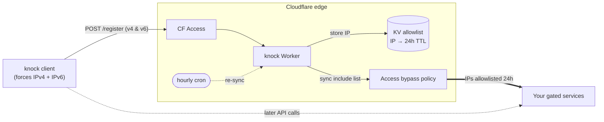

# knock

A small Cloudflare Worker that gates access to CF-Access-protected services by
dynamically updating a reusable CF Access bypass policy with the caller's IP.

Useful when you want a CF Access app accessible via a long-lived OIDC login on
your own browsers, plus a knock-style "tap to unlock" flow for clients (apps,
scripts, mobile shortcuts) that cannot do OIDC.

## Architecture



## How it works

1. Client `POST`s `/register` against the Worker.
2. Worker reads the caller's IP (`CF-Connecting-IP`) and optionally additional
   IPs from a JSON body (see [Dual-stack callers](#dual-stack-callers)).
3. Worker stores each IP in KV with a 24h TTL.
4. Worker reads all live IPs from KV and PATCHes them into the configured CF
   Access bypass policy's `include` rules.
5. An hourly cron re-sync resolves drift between Worker writes and policy state.

`DELETE /register` removes IPs the same way.

## Client

`knock` is a tiny client that registers BOTH your IPv4 and IPv6 egress in one
command — no shell alias, no `jq`. It forces each family at the socket and lets
Cloudflare's dual-stack edge report the correct address for each.

Install a prebuilt binary from the [Releases](../../releases) page, or build
from source:

    go install github.com/jamesbraid/knock/cmd/knock@latest

Usage (requires `cloudflared` for the CF Access login, same as before):

    knock --url https://knock.example.com/register
    # registered: v4=203.0.113.7  v6=2001:db8::42

    export KNOCK_URL=https://knock.example.com/register
    knock           # register both families
    knock -d        # unregister both families

On a single-stack network the unreachable family is reported and ignored:

    registered: v4=203.0.113.7   (v6: no route)

## Dual-stack callers

A single `POST /register` only allowlists ONE IP — the address CF saw the
request come from. On a dual-stack network where your IPv4 and IPv6 egress
differ (most home ISPs, mobile networks), a follow-up request to a
CF-Access-gated app may go over the OTHER family and get blocked.

The `knock` client handles this automatically. If you prefer raw `curl`:

**Single call with `extra_ips`**:

```bash
V4=$(curl -4 -s --max-time 3 ifconfig.me)
V6=$(curl -6 -s --max-time 3 ifconfig.me)
BODY=$(jq -nc --arg v4 "$V4" --arg v6 "$V6" '{extra_ips: [$v4, $v6] | map(select(. != ""))}')
cloudflared access curl https://knock.example.com/register \
  -X POST \
  -H "Content-Type: application/json" \
  -d "$BODY"
```

The Worker dedupes against `CF-Connecting-IP`, validates basic IP shape, and
caps `extra_ips` at 10 entries. Invalid strings are silently dropped.

## Required Cloudflare resources

You provision these in your own account — the `deploy/` module does it for you,
or use Terraform/dashboard directly:

- A KV namespace bound as `IP_ALLOWLIST` in `wrangler.toml`
- A Cloudflare Access "Reusable Policy" with `decision = bypass` whose `include`
  list this Worker rewrites
- A CF API token with Zero Trust Edit scope (passed as the `CF_API_TOKEN` secret)

## Self-hosting

The `deploy/` OpenTofu module provisions the Cloudflare resources knock needs —
a KV namespace, the dynamic bypass policy, an email-allowlist admin policy, and
the knock Access app. It needs **no external identity provider**: logins use
Cloudflare's One-Time PIN (a code emailed to allowed addresses).

    cd deploy
    cp terraform.tfvars.example terraform.tfvars   # fill in your values
    export CLOUDFLARE_API_TOKEN=...                 # token with Zero Trust + Workers edit
    tofu init && tofu apply

    KV_ID=$(tofu output -raw kv_namespace_id)
    BYPASS_ID=$(tofu output -raw bypass_policy_id)
    cd ..

    # Deploy the Worker with your KV id wired in:
    perl -i -pe "s/REPLACE_KV_NAMESPACE_ID/$KV_ID/" wrangler.toml
    npx wrangler deploy
    printf '%s' "$CLOUDFLARE_API_TOKEN" | npx wrangler secret put CF_API_TOKEN
    printf '%s' "$CF_ACCOUNT_ID"        | npx wrangler secret put CF_ACCOUNT_ID
    printf '%s' "$BYPASS_ID"            | npx wrangler secret put BYPASS_POLICY_ID

Then attach the bypass policy to whichever Access apps you want knock to unlock.

## Why not a zero-client approach?

The nicest UX would be a single `curl` with no binary at all. It can't work on
Cloudflare, and the reason is worth recording:

- A single HTTP request only reveals ONE IP family — whichever the connection
  used. To register both, something must make a second observation over the
  other family.
- The slick idea is to let the Worker `307`-redirect a `curl -L` to a
  family-pinned hostname and capture the other family there. The CF Access token
  survives the cross-host redirect (it rides as a header), so auth isn't the
  problem — but Cloudflare can't serve a per-hostname **single-family** proxied
  endpoint: proxied records are always dual-stack, the IPv6 toggle is zone-wide,
  and IPv4 can't be disabled at all. So the redirect can force v4 but never v6.
- The client sidesteps all of this by forcing the family **client-side** at the
  socket, against the normal dual-stack endpoint. No Worker or DNS changes.

## Deployment

`wrangler.toml` has a placeholder `REPLACE_KV_NAMESPACE_ID` that your deploy
harness substitutes before `wrangler deploy`:

```bash
KV_ID="<your-kv-namespace-id>"
BYPASS_ID="<your-access-bypass-policy-id>"

sed -i.bak "s/REPLACE_KV_NAMESPACE_ID/${KV_ID}/" wrangler.toml
npx wrangler deploy

printf '%s' "$CF_API_TOKEN_VALUE" | npx wrangler secret put CF_API_TOKEN
printf '%s' "$CF_ACCOUNT_ID"      | npx wrangler secret put CF_ACCOUNT_ID
printf '%s' "$BYPASS_ID"          | npx wrangler secret put BYPASS_POLICY_ID
```

## Local development

```bash
npm ci
npm test                         # vitest unit tests
npx wrangler dev                 # local Worker preview
npx wrangler deploy --dry-run    # verify it builds
```

## Contributing

This GitHub repo is a public mirror of a repo I develop privately. Issues are
welcome here. PRs are too, but heads-up: the mirror is one-way, so I port
accepted changes by hand and the merge happens upstream — expect a little delay.

## License

MIT — see [LICENSE](LICENSE).
